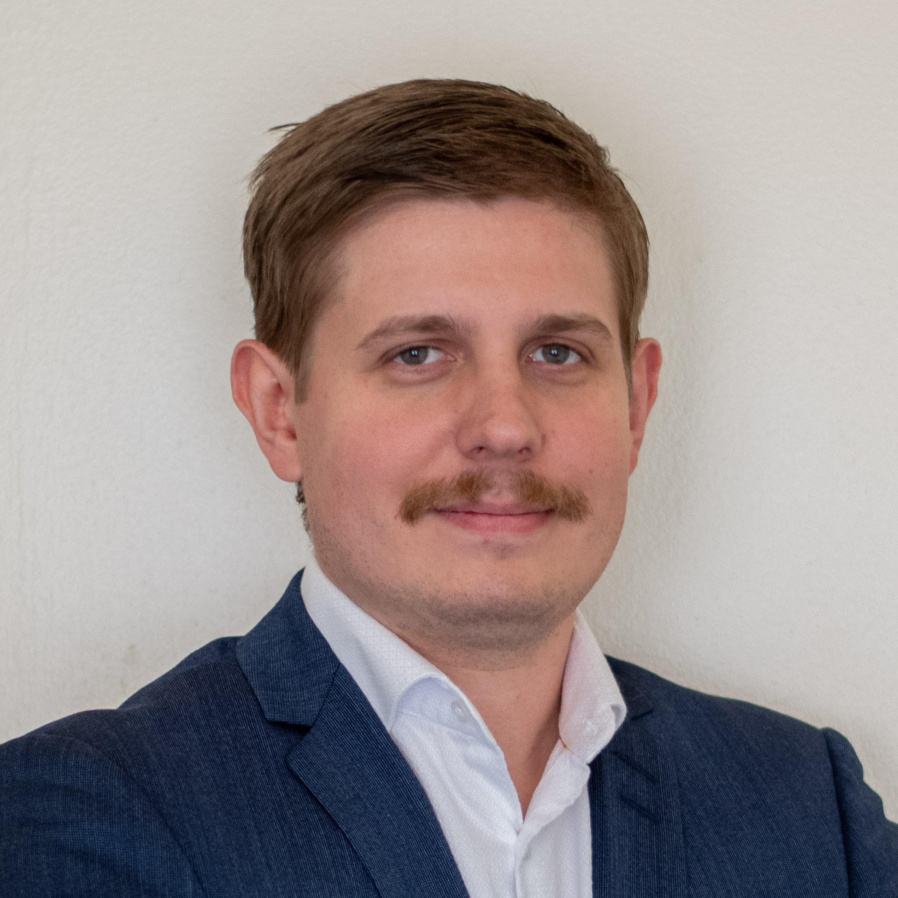
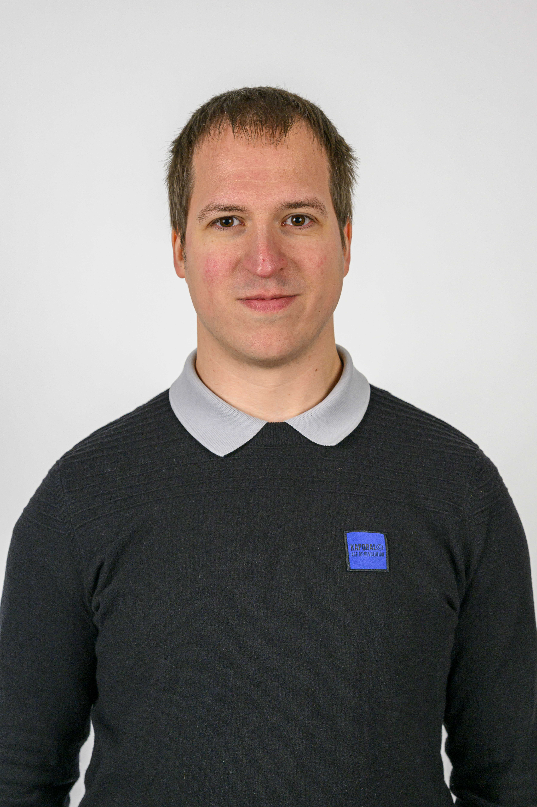
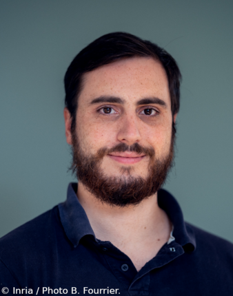

# Contacts: 

## Program Chair: Julien Loiseau (jloiseau@lanl.gov)

Julien is a High-Performance Computing scientist in the Co-Design Team at LANL. His research focuses on the new parallel and distributed architectures for the next generation of supercomputers for scientific simulation. He is currently working on several aspects of development from topology in FleCSI, GPU support using Kokkos in the Exasheds project and Smoothed Particles Hydrodynamics as lead CS developer of FleCSPH.
Julien is an alumnus of the 2016 summer school class and now the lead of the Co-Design Summer School at LANL.

## Program Co-Chair: Adrien Roussel (adrien.roussel@cea.fr)

Adrien Roussel is currently a Research Engineer in Computer Science (HPC) at CEA since 2019. He obtained his PhD in Computer Science in 2018, on the parallelization of iterative linear solvers with a task-based programming model for many-core architectures. His research then oriented him towards dynamic scheduling techniques in distributed applications through a post-doc carried out at Fraunhofer-ITWM in Germany for 1 year.
He is in charge of R&D for the OpenMP standard and its interaction with MPI. His main research topic is the efficient use of supercomputers through runtime systems, in particular OpenMP and the task-based programming model. He is also interested in the use of heterogeneous memories and GPU computing.
Since early 2023, Adrien Roussel is in charge of the MPC project team.
Adrien Roussel is currently supervising 4 PhD theses and has already supervised several interns and engineers. He has (co-)authored several international conference research papers.

## Local Chair: Clément Foyer (clement.foyer@univ-reims.fr)

Clément FOYER is an associate professor at the Université de Reims Champagne-Ardenne. He was awarded a PhD by the University of Bristol in 2021, where he studied while collaborating with the HPE HPC&AI EMEA Research Lab (formerly Cray EMEA Research Lab).
His main research topic is the management of data in heterogeneous memory systems, from the adequacy of the data placement with regards to its usage, to the availability of such solutions for application developers.
His current research focuses on framework design for facilitated memory management in HPC applications and on the definition of heuristics to drive the placement of data.

