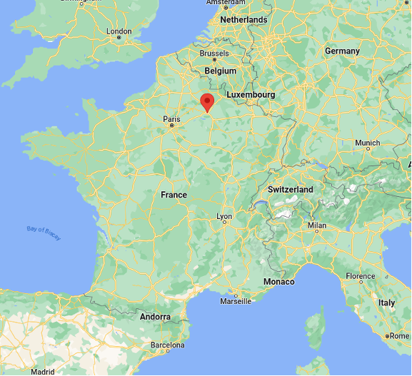

### Location: 

University of Reims Champagne-Ardenne, Reims, France. 

### Dates: 

-	Classes: the 22nd to the 26th of January 2024. 
-	Deadline for registration: November 2023

### Inscription fees will cover: (Price TBD)
-	Winter School Attendance
-	Hotel from Monday 22nd to Friday 26th 
-	Meals (Breakfast + Lunch + Dinner) 
-	Social Event: Champagne Cave visit 

### Targeted audience: 	
International students from: 
-	Masters
-	Ph.D.
-	PostDoc
-	Junior Researchers. 

### Program (Draft) 

| Monday                                          	| Tuesday                        	| Wednesday                       	| Thursday                                         	| Friday  	|
|-------------------------------------------------	|--------------------------------	|---------------------------------	|--------------------------------------------------	|---------	|
|                                                 	| CEA/DAM TBD                 	| LANL CDSS Christoph Junghans 	| Panel: CEA/NNSA Recruiting                    	| Kokkos  	|
| Check-in                                        	| Lecture MPC Adrien Roussel  	| NNSA Edgar Leon              	| Lecture FleCSI  Ben Bergen Davis Herring  	|         	|
| Lunch + Welcome Julien Loiseau               	| Lunch                          	| Lunch                           	| Lunch                                            	| Lunch   	|
| Lecture Task-Based Parallelism Clément Foyer 	| Hands-on MPC Adrien Roussel 	| Student's Posters Session       	| Hands-on FleCSI  Ben Bergen Davis Herring 	| Wrap-up 	|
|                                                 	|                                	| Social Event                    	|                                                  	|         	|

### Speakers: 
TBD

